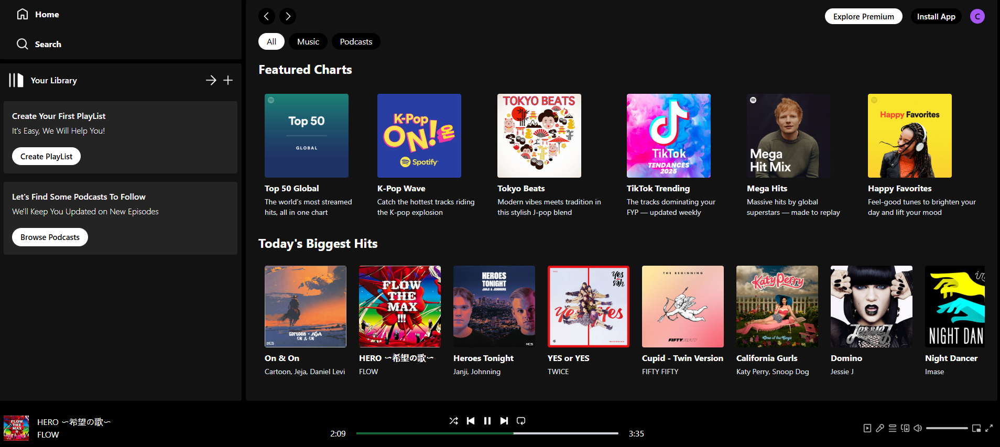

# 🎧 Spotify Clone (Frontend Only)

A sleek and responsive Spotify-inspired music player built with **React.js** and **Tailwind CSS**. This is the **frontend portion** of the project, featuring album browsing, song playback, seek bar progress, and playlist interaction — all designed to simulate a real streaming experience.

---

## ✨ Features

- 🎵 Browse Featured Charts & Trending Tracks  
- 🖼️ Dynamic album cards with custom image covers  
- ▶️ Play/pause songs and interact with media controls  
- ⏱️ Real-time audio progress bar with duration tracking  
- 🔄 Loop, shuffle, and queue icons (UI-only)  
- ⚡ Responsive design using Tailwind CSS  

---

## 📸 Preview

  

---

##  🌍 LIVE DEMO:
- Try it Out: https://chrisw0987.github.io/spotify-clone/
---

## 🛠 Tech Stack
**React** 
**Tailwind CSS**
**React Router DOM**
**HTML5 `<audio>`** 

---

## 🚧 Backend Plan (Coming Soon)

- User authentication (login/signup)  
- Playlist saving & favoriting  
- Music streaming from API/database  
- Admin dashboard for adding songs  

> _You're viewing the frontend-only version — backend integration is planned for future development.

---

## 🚀 Getting Started

1. **Clone this repo**
   ```bash
   git clone https://github.com/chrisw0987/spotify-clone.git
   cd spotify-clone
